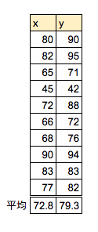
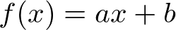
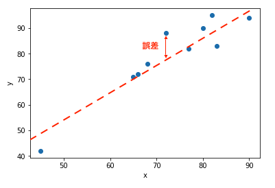
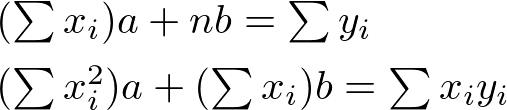
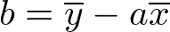
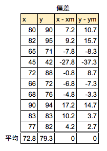
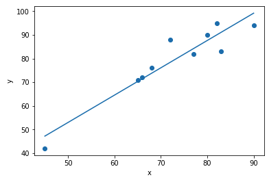
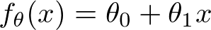
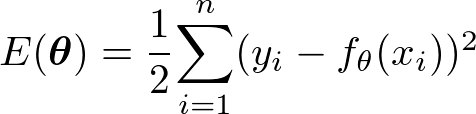

# 機械学習アルゴリズム - Linear Regression

ここではLinear Regression（線形回帰）の考え方について取り上げます。

## 例題：テストの点数を求めるプログラム

次のデータは数学のテスト結果（x）と物理のテスト結果（y）を並べたものです。



ここで数学のテスト結果（x）から、物理のテスト結果（y）を求める回帰方程式 f(x) を求めるものとします。



上記の係数 a と 切片 b を求めることが狙いです。改めてテストの結果を散布図にして確認してみましょう。



各点との誤差を最小にする1本の直線を引くことが狙いです。

<div style="page-break-before:always"></div>


### 最小二乗法

最小二乗法では、正解と予測値の誤差を最小にするパラメータ（ここでは係数aと切片b）を求めます。


ここで二乗誤差の総和を求める関数Lは、a,bの二変数関数の二次式と考えることができます。つまり二乗誤差の総和の最小はa,bで偏微分して0とおくことで求めることができます。関数Lをa,bで偏微分して0になる式を求めると次のようになります。



上記の連立方程式を解くとa, bは次の数式で求めることができます。




> 

またaの式は次のように置き換えることができます。


この係数aは 分子にxとyの共分散、分母にxの分散をとると考えることもできます。


<div style="page-break-before:always"></div>

実際のデータで確認してみましょう。まずはxとyについて各々の平均との偏差を求めます。



次に偏差の二乗和を求めてxとyの分散を求めます。またxとyの共分散を求めます。


上記の表からxの分散は145.76、yの分散は219.81と読み取ることができます。またxとyの共分散は168.36です。

<div style="page-break-before:always"></div>

それでは数式に代入して傾きaを求めてみましょう。

```
a = 168.36 / 145.76 = 1.155
```

切片bを求めます。

```
b = 79.30 - 1.155 * 72.8 = -4.784
```

以上から回帰方程式は次のようになります。

```
f(x) = 1.155 * x -4.784
```

実際にグラフで表示してみましょう。次のようになります。



<div style="page-break-before:always"></div>


### 勾配降下法

勾配降下法によるパラメータの算出にもチャレンジしてみましょう。

あらためて数学のテスト結果（x）から、物理のテスト結果（y）を求める回帰方程式 f(x) を求めるものとします。


求めたいパラメータa,bをベクトルθに置き換えると次のように表現できます。



最小二乗法の考え方に従い、次の誤差の総和を求める式を考えます。



> 1/2を乗算するのは後の微分をスムーズにするためです。

このような関数は目的関数などと呼ばれます。パラメータθを更新して、目的関数の出力する値を最小化するのが狙いです。

ここで目的関数Eをθ0、θ1で偏微分すると次のようになります。


偏微分で求めた導関数に学習率（η：ETA）を乗算してパラメータを更新します。学習率とはハイパーパラメータと呼ばれるもので、0.1や0.01といった値を設定します。


学習率が大きいとパラメータの更新は速くなりますが収束せずに発散してしまう可能性があります。一方で学習率の値が小さすぎると値が収束するまでの計算回数が多くなってしまいます。

以上でパラメータを更新する式を求めることができました。機械学習では上記の更新処理を繰り返し行うことで最適なパラメータを導出することができます。

> 繰り返し計算を行うことをEpochと呼びます。
