# 機械学習アルゴリズム - Logistic Regression

ここではLogistic Regression（ロジスティック回帰）の考え方について取り上げます。

## ロジスティック関数

ロジスティック回帰は、確率（0〜1）の値を出力するアルゴリズムです。たとえば受信したメールについて、スパムメールかそうでないかを分類（2値分類）する用途に利用できます。

ロジスティック回帰では次のような関数を使います。

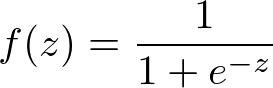

> z = ax + b のような式をとります。

この関数はロジスティック関数、またはシグモイド関数などと呼ばれます。

ロジスティック関数をグラフに描画すると次のようになります。

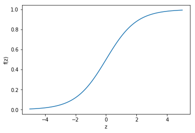

ロジスティック関数の出力はS字を描くような滑らかな曲線になります。入力であるzの値が小さければ出力は0に近づきます。逆に大きければ1に近づきます。またzの値が0のとき出力は0.5となります。

|z|-∞|0|∞|
|:--|:--|:--|:--|
|exp(-z)|∞|1|0|
|1 / (1 + exp(-z))|0|0.5|1|

さきほどのスパムメールのケースを考えてみましょう。ロジスティック関数の出力は0〜1の間の値（確率）を出力するので、0.5以上の場合はスパムメールと判定し、0.5未満の場合はスパムメールでない、と判定することができます。

ロジスティック回帰において求めるパラメータは入力となるzを決定するものです。たとえば次のような式が考えられます。

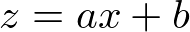

この場合、求めるパラメータは係数a、切片bです。

zの式をもう少し汎用的に表現すると次のようになります。

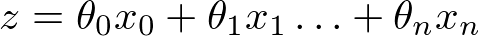

この場合、求めるパラメータは係数θです。またθ0は切片（バイアス）です。このときx0は定数 1となります。

またパラメータをθベクトル、入力をxベクトルとすれば次のように表現できます。

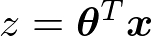

> Tは転置を意味します。

## 例題：品種を判定するプログラム

次のデータは花弁の縦幅、横幅と、品種Aであるかどうかを示したものです。品種A列が1のものは、品種Aに該当するものとし、0のものは品種Aに該当しないものとします。

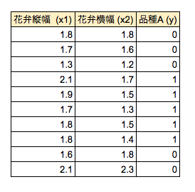

ここで花弁縦幅（x1）、花弁横幅（x2）から、品種Aであるかないかを求める方程式を求めるものとします。

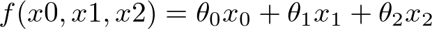

> x0には定数1を代入します。またθ0は切片（バイアス）を意味します。

またθ0、θ1、θ2をθベクトル、x0、x1、x2をxベクトルで表現すると次のようになります。

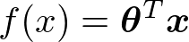

上記の式のパラメータであるθベクトルを求めることが狙いです。

改めて品種Aの分類結果を散布図にして確認してみましょう。青丸が品種Aです。

品種Aとそれ以外を分類する直線を求めることが目的です。

### 尤度関数

ロジスティック回帰では尤度を最大化するパラメータを求めます。

> 尤度（ゆうど）とはパラメータの尤もらしさを表すものです。

各レコードについて次のように確率を表現してみましょう。

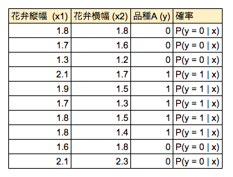

確率はP(y=N|x)は1に近づくほど理想的な状態と言えます。

10件のレコードの同時確率を求めると次のようになります。

これを一般化して表現すると次のようになります。

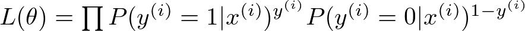

上記の関数の出力する値が尤度です。この関数は尤度関数と呼ばれます。つまり尤度関数の出力を最大化するパラメータ（θ）を求めることが狙いです。

尤度関数は確率の総乗です。これは少数（確率）を繰り返し掛け算ということです。このようなケースでは値が小さくなってしまう可能性があるため、このままでは扱いにくいものになります。そこで尤度関数の両辺に対数をとり、次のような関数に置き換えます。

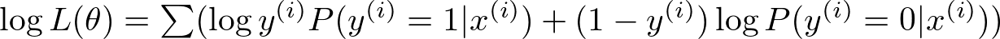

これを対数尤度関数と呼びます。対数は単調増加関数であるため、尤度関数の最大値を求めることと対数尤度関数の最大値を求めることは同義です。以降は対数尤度関数をパラメータ（θ）で偏微分して、パラメータの更新式を求めます。

対数尤度関数をθjで偏微分を求めると次のようになります。

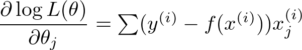

偏微分で求めた導関数に学習率（η：ETA）を乗算してパラメータを更新します。学習率とはハイパーパラメータと呼ばれるもので、0.1や0.01といった値を設定します。パラメータの更新式は次のようになります。

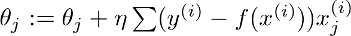

学習率が大きいとパラメータの更新は速くなりますが収束せずに発散してしまう可能性があります。一方で学習率の値が小さすぎると値が収束するまでの計算回数が多くなってしまいます。

以上でパラメータを更新する式を求めることができました。機械学習では上記の更新処理を繰り返し行うことで最適なパラメータ（θ）を導出することができます。

> 繰り返し計算を行うことをEpochと呼びます。

求めたパラメータによって直線を描画すると次のようになります。

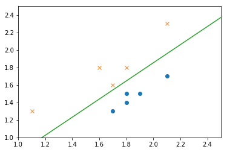
